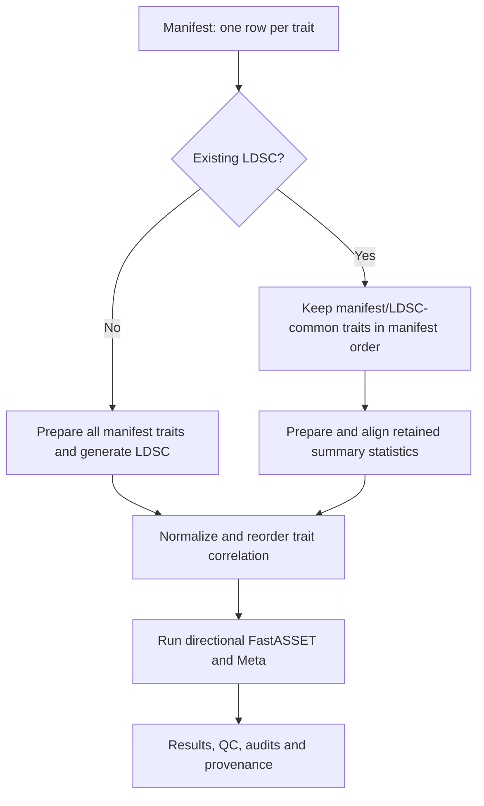

# fastASSETcli

`fastASSETcli` is an installable R package with a shell command for running a
reference-aligned FastASSET analysis across many traits. One per-trait summary
statistics manifest is the only analysis input. The package builds the internal
wide FastASSET table, obtains the GenomicSEM LDSC intercept covariance, retains
manifest/LDSC-common traits in manifest order, runs directional FastASSET and
writes auditable results and structural validation records.

The package can:

- read tabular summary statistics or GWAS-VCF/BCF files;
- use an existing GenomicSEM LDSC object or generate one automatically;
- process quantitative and binary traits using the required sample-size rules;
- merge VCF traits on allele-encoded IDs and align tabular effects without
  requiring `--fastasset-input`;
- run the positive/negative FastASSET search and ASSET Meta analysis; and
- resume compatible preparation, LDSC and analysis outputs.

## Start here

- [Complete workflow, scientific rules and full flowchart](inst/docs/WORKFLOW.md)
- [Reference comparison and severity-ranked corrections](inst/docs/REFERENCE_COMPARISON.md)
- Run `fastasset --help` after installation for every CLI option and default.

## Workflow at a glance



The [complete workflow page](inst/docs/WORKFLOW.md) explains every processing
step, decision, failure route and output.

## Requirements

| Requirement | When it is needed |
|---|---|
| R 4.1 or newer | Always |
| `ASSET` and `data.table` | Always; installed by `install.sh` |
| GenomicSEM | Automatic LDSC mode; installed by `install.sh` |
| `gzip` | Always |
| `bcftools` | Only when a manifest contains VCF/BCF files |
| HapMap3 SNP list and LD-score reference | Only when generating LDSC automatically |
| Linux or macOS | Required for more than one forked FastASSET worker |

## Installation

Clone the repository and run the installer:

```bash
git clone https://github.com/JIBINJOHNV/fastASSETcli.git
cd fastASSETcli
chmod +x install.sh
./install.sh
```

The installer creates an isolated R library under
`~/.local/share/fastassetcli/R-library` and links the command to
`~/.local/bin/fastasset`. If that directory is not on `PATH`, add it:

```bash
export PATH="$HOME/.local/bin:$PATH"
```

Verify the installation:

```bash
fastasset --version
fastasset --help
```

Custom installation locations can be supplied without a configuration file:

```bash
FASTASSET_R_LIB=/opt/R/fastasset \
FASTASSET_BIN_DIR=/opt/bin \
./install.sh
```

The package is named `fastASSETcli`; it does not overwrite or shadow the
upstream `fastASSET` project.

## Step 1: Create the summary-statistics manifest

Create a tab- or comma-delimited file with one row per trait. Only `TRAIT` and
`FILE` are universally required.

```text
TRAIT              FILE                                N     SAMPLE  SAMPLE_PREV  POPULATION_PREV
quantitative_1     /data/quantitative_1.tsv.gz         NA    NA      NA           NA
binary_1           /data/binary_1.vcf.gz               NA    NA      NA           0.02
```

| Column | Required | Meaning |
|---|---:|---|
| `TRAIT` | Yes | Unique trait name. Manifest row order becomes the canonical FastASSET and LDSC order. |
| `FILE` | Yes | Path to TSV/CSV, compressed table, VCF, VCF.GZ, VCF.BGZ or BCF. Relative paths are resolved from the manifest directory. |
| `N` | Sometimes | Constant trait sample size when a tabular file has no per-SNP N/NEF column. Do not provide it for VCF/BCF. |
| `SAMPLE` | Sometimes | Exact sample ID for a multi-sample VCF/BCF. Leave `NA` for one-sample VCFs and tabular files. |
| `SAMPLE_PREV` | Binary tables | Sample prevalence. For binary VCFs it may be `NA` and is calculated from median NC/NCO. |
| `POPULATION_PREV` | Binary traits | Population prevalence. Leave both prevalence fields `NA` for quantitative traits. |

Accepted aliases include `NAME` for `TRAIT`, `SPREV` for `SAMPLE_PREV` and
`PPREV` for `POPULATION_PREV`.

For tabular inputs, FastASSET preparation needs SNP ID, A1, A2, BETA, SE and a
sample-size source. Nonstandard column names can be mapped through the CLI:

```bash
--munge-column-map 'SNP=ID,A1=EA,A2=NEA,effect=BETA,SE=SE,N=NEF,P=P'
```

## Step 2: Choose how LDSC is obtained

### Option A: Use an existing GenomicSEM LDSC object

Use this mode when the trait collection already has a saved GenomicSEM object
containing `$I`. Trait names are taken from the native GenomicSEM `$S` order.
Only traits common to the manifest and LDSC object are retained, in manifest
order. Traits missing on either side are warned and written to a matching audit.

```bash
fastasset \
  --sumstats-manifest /data/manifest.tsv \
  --ldsc-rdata /data/all_traits_LDSCoutput.RData \
  --ldsc-object-name LDSCoutput \
  --output-dir /results/fastasset \
  --run-name traits250 \
  --ncores 90 \
  --chunk-size 1000 \
  --scr-pthr 0.05 \
  --max-traits-per-side 16 \
  --include-meta TRUE
```

### Option B: Generate LDSC automatically

Omit `--ldsc-rdata` and provide HapMap3 and LD-score references. The CLI runs
`GenomicSEM::munge()` per trait, runs `GenomicSEM::ldsc()`, saves the complete
LDSC object and then continues to FastASSET.

```bash
fastasset \
  --sumstats-manifest /data/manifest.tsv \
  --hm3 /refs/w_hm3.snplist \
  --ld-ref /refs/eur_w_ld_chr \
  --output-dir /results/fastasset \
  --run-name traits250 \
  --ncores 90 \
  --munge-cores 90 \
  --vcf-cores 90 \
  --chunk-size 1000 \
  --scr-pthr 0.05 \
  --max-traits-per-side 16 \
  --include-meta TRUE
```

Use `--wld-ref` only when LD-score weights are stored separately from
`--ld-ref`. `bcftools` must be on `PATH` for VCF/BCF inputs, or its executable
must be supplied with `--bcftools /path/to/bcftools`.

Everything is supplied through the shell CLI; no YAML configuration file is
read.

## Input and scientific rules

### Sample size

| Trait/input type | LDSC N | FastASSET NEF |
|---|---|---|
| Quantitative table | Per-SNP NEF/N, or manifest `N` | Same value, used directly as total analyzed N |
| Binary table with NC/NCO | Per-SNP total N or manifest `N` | `NC*NCO/(NC+NCO)` |
| Binary table without NC/NCO | Per-SNP total N or manifest `N` | `N*SAMPLE_PREV*(1-SAMPLE_PREV)` |
| Quantitative VCF | `FORMAT/NEF` | `FORMAT/NEF`, used directly |
| Binary VCF | `FORMAT/NC + FORMAT/NCO` | `FORMAT/NC*FORMAT/NCO/(FORMAT/NC+FORMAT/NCO)` |

For a binary VCF, one LDSC sample prevalence is calculated as
`median(NC)/(median(NC)+median(NCO))` across valid SNP rows. VCF header case and
control totals are retained only as provenance.

### VCF conversion

Converted files use both manifest order and a filesystem-safe version of the
exact manifest `TRAIT`, for example
`trait_0002_ANXA1_P04083_OID30617_v1_Inflammation_II.tsv.gz`. The corresponding
metadata and in-progress `bcftools-query`/stderr files use the same stem, so a
file remains traceable to its trait during parallel conversion. The resolved
manifest preserves the original, unsanitized trait name.

GWAS-VCF fields are interpreted as follows:

- `SNP=VCF ID` for GenomicSEM munging; repeated rsIDs are retained;
- `FASTASSET_ID=CHR_POS_REF_ALT` after chromosome and allele normalization;
- `A1=ALT`, `A2=REF` and `BETA=FORMAT/ES`;
- `P=10^(-FORMAT/LP)`, with unrepresentably small values capped at the smallest
  positive R double;
- `AF=FORMAT/AF`; automatic munging maps this allele-frequency column to
  GenomicSEM's `MAF` input role;
- `INFO=FORMAT/SI` when present; and
- a VCF declaring `StudyType=CaseControl` requires `POPULATION_PREV`.

The two identifiers serve different branches. `GenomicSEM::munge()` receives
the original `SNP`/rsID and performs HapMap3 ID-and-allele matching. The
FastASSET-wide table uses `FASTASSET_ID`, so multiallelic records that share an
rsID remain distinct. Missing VCF IDs are permitted: those rows can still enter
FastASSET through `FASTASSET_ID`, while munging decides whether they match its
reference. The converter does not pre-deduplicate rsIDs.

Each converted file is self-describing. Its columns are written in this order
(optional fields appear only when available):

```text
SNP  FASTASSET_ID  A1  A2  BETA  SE  P  N  [INFO]  CHR  POS  LP  AF  [SS]  [NC  NCO]  [NEF]
```

The converter does not introduce additional MAF, INFO, MHC, population-AF or
palindromic-variant QC thresholds. Input is assumed to have completed the
user's scientific QC. Structural requirements needed to calculate valid
statistics are still enforced.

### FastASSET merging and allele handling

For VCF/BCF inputs, FastASSET merges on `CHR_POS_REF_ALT`. Because the ordered
REF/ALT pair is already part of that identifier and GWAS-VCF effects are defined
relative to ALT, no second cross-trait allele comparison or sign flip is
performed. `fastasset_variant_id_map.tsv.gz` links every canonical ID back to
trait, rsID, chromosome, position, REF and ALT.

For tabular inputs, the first observed allele pair for each SNP establishes its
reference orientation:

| Incoming pair | Action |
|---|---|
| Exact A1/A2 match | Keep BETA |
| Exact A1/A2 swap | Multiply BETA by -1 |
| Incompatible pair | Set BETA, SE and NEF to `NA` for that trait at that SNP and record the failure |

Incompatible observations are saved in
`fastasset_failed_allele_alignments.tsv`. Before screening or ASSET, invalid or
missing trait observations are removed and the correlation matrix is subset to
the remaining traits. With the default `--min-available-traits 1`, a SNP with
one valid trait follows the published closed-form two-sided z test without
screening. Setting the minimum to 2 instead records
`INSUFFICIENT_VALID_TRAITS` for such a SNP.

## Recommended settings for 200–250 traits

```text
--ncores 90
--munge-cores 90
--vcf-cores 90
--chunk-size 1000
--scr-pthr 0.05
--max-traits-per-side 16
--min-available-traits 1
--include-meta TRUE
```

The default per-direction guard is 16 screened traits. Values above 16 are
sensitivity settings and the CLI permits at most 30. More CPUs parallelize SNP
chunks; they do not parallelize subset enumeration within one SNP.

For more than 18 traits, current GenomicSEM increases the LDSC jackknife block
count to `((traits+1)*(traits+2)/2)+1`. Munging can use multiple workers, but
`GenomicSEM::ldsc()` itself does not expose a worker-count argument.

## Main outputs

| Output | Purpose |
|---|---|
| `*_fastasset_results.tsv.gz` | Positive/negative directional subset results |
| `*_fastasset_meta.tsv.gz` | Fixed-effect Meta output for multi-trait ASSET rows and the one-trait closed-form equivalent |
| `*_fastasset_qc.tsv.gz` | Per-SNP status, severity, screening flag, analysis scope, valid/invalid traits, direction counts and runtime |
| `*_direction_limit_exceeded.tsv.gz` | SNPs skipped because the screened-trait guard was exceeded; analysis continues for other SNPs |
| `*_fastasset_summary.tsv` | Counts by QC status and severity |
| `manifest_ldsc_trait_match.tsv` | Common traits and traits missing from either the manifest or LDSC, with retained analysis order |
| `fastasset_variant_id_map.tsv.gz` | VCF `FASTASSET_ID` to original rsID and locus/allele mapping, by trait |
| `fastasset_failed_allele_alignments.tsv` | Every excluded incompatible SNP–trait observation |
| `*_LDSCoutput.RData` | Automatically generated GenomicSEM LDSC object |
| `trait_correlation_normalized.tsv.gz` | Normalized and reordered correlation used by FastASSET |
| `analysis_settings.tsv` | Resolved scientific, compute and provenance settings |

Prepared input, automatic LDSC and FastASSET analysis each use separate
signature-addressed directories. Completed compatible work is reused on rerun;
partial or signature-incompatible work is not silently reused. The
[complete workflow page](inst/docs/WORKFLOW.md#output-directory-structure)
lists every important output and directory.

## Manual package installation

If dependencies are already installed:

```bash
R CMD INSTALL .
# or
R CMD INSTALL release/fastASSETcli_0.5.1.tar.gz
```

## Scientific behavior in one place

- Manifest row order is canonical among traits common to the manifest and
  LDSC object. Non-common manifest rows, including their sample/file entries,
  are excluded with warnings and an audit record.
- GenomicSEM `$I` is loaded or generated, then normalized as
  `D^(-1/2) I D^(-1/2)` and checked for positive definiteness.
- With one valid trait before screening, the published ordinary two-sided GWAS
  z test is used. With one trait after screening, the published closed-form
  test uses its selection-adjusted z statistic. ASSET enumeration is bypassed
  in both cases.
- For two or more screened traits, ASSET is called with `side=2`, `search=2`
  and `meta=TRUE` by default.
- Multi-trait Meta output contains screened, selection-adjusted traits; it is
  not an ordinary fixed-effect meta-analysis of every original trait.
- The primary guard remains 16 screened traits per direction.

See the [complete workflow](inst/docs/WORKFLOW.md) for the step-by-step logic
and the [reference comparison](inst/docs/REFERENCE_COMPARISON.md) for the
scientific rationale and severity of each correction.

## Release archive

`release/fastASSETcli_0.5.1.tar.gz` is the current installable source archive.
Earlier archives remain available for reproducibility.

## Upstream terms

This workflow contains adapted fastASSET logic and calls ASSET. Review the
terms of both upstream projects before public redistribution. The upstream
fastASSET repository does not currently declare a standard license in its
`DESCRIPTION`, while ASSET provides separate NCI terms. Keeping a new GitHub
repository private is recommended until redistribution permission is clear.
