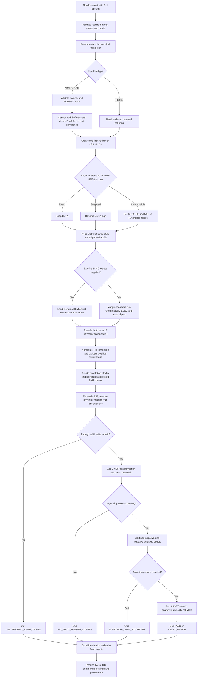

# Complete fastASSETcli workflow

This page describes the complete processing order from the CLI command to the
final FastASSET, Meta and QC files. The manifest is the only summary-statistics
input. The pipeline does not accept or require a separately created
`--fastasset-input` file.

[Return to the main README](../../README.md)

## Complete process flowchart



## Step-by-step processing

### 1. Parse and validate the CLI

The command determines the LDSC mode from the supplied options:

- `--ldsc-rdata` supplied: existing-LDSC mode;
- `--ldsc-rdata` omitted: automatic-LDSC mode, requiring `--hm3` and
  `--ld-ref`.

The CLI validates all required paths, option ranges, output permissions and
mode-specific combinations before scientific processing starts. Unknown or
duplicated options are rejected.

### 2. Read and validate the manifest

The manifest must contain one unique row per trait and readable paths. Its row
order becomes the canonical trait order for:

- columns in the prepared FastASSET table;
- both axes of the LDSC intercept covariance matrix; and
- every downstream trait-indexed result.

The same manifest supports tabular and VCF/BCF inputs. A file can be repeated
only for distinct, explicitly named samples in a multi-sample VCF/BCF.

### 3. Convert VCF/BCF inputs when present

VCF/BCF files are converted in parallel with `bcftools`. A one-sample VCF is
selected automatically; multi-sample VCFs require the exact manifest `SAMPLE`.

The standardized representation uses:

| Output field | VCF source or calculation |
|---|---|
| SNP | VCF ID; rows with missing or `.` IDs are excluded |
| A1 | ALT |
| A2 | REF |
| BETA | `FORMAT/ES` |
| SE | `FORMAT/SE` |
| P | `10^(-FORMAT/LP)` |
| MAF | `min(FORMAT/AF, 1-FORMAT/AF)` |
| INFO | `FORMAT/SI`, when present |
| Quantitative N | `FORMAT/NEF` |
| Binary LDSC N | `FORMAT/NC + FORMAT/NCO` |

For a binary VCF, one sample prevalence is calculated as
`median(NC)/(median(NC)+median(NCO))`. Header totals are retained as provenance
and are not substituted for the per-SNP counts.

### 4. Read tabular inputs

The input builder identifies SNP ID, A1, A2, BETA, SE and the required
sample-size source. It rejects missing/invalid IDs, duplicate SNP IDs within a
trait and alleles other than distinct single-base A/C/G/T values.

Column names are detected from accepted aliases or from
`--munge-column-map`. This same mapping is used for internal FastASSET
preparation and automatic GenomicSEM munging where applicable.

### 5. Calculate the FastASSET sample-size quantity

The internal `<trait>.NEF` columns use these rules:

- quantitative trait: total analyzed NEF/N is used directly;
- binary trait with case/control counts:
  `Ncase*Ncontrol/(Ncase+Ncontrol)`;
- binary trait without counts:
  `N*SAMPLE_PREV*(1-SAMPLE_PREV)`.

No four-times rescaling is applied to the binary FastASSET quantity.

### 6. Build one indexed SNP union

The pipeline creates one union of SNP IDs and fills each trait's BETA, SE and
NEF columns by indexed matching. It does not repeatedly merge an expanding
wide table. A SNP absent from a trait remains `NA` for that trait.

### 7. Align alleles across traits

The first observed A1/A2 pair for a SNP establishes the reference orientation.

| Relationship | BETA | SE and NEF | Analysis action |
|---|---|---|---|
| Exact pair | Unchanged | Unchanged | Trait retained |
| Exactly swapped pair | Multiplied by -1 | Unchanged | Trait retained |
| Incompatible pair | `NA` | Both set to `NA` | Trait excluded only at this SNP |

Every incompatible SNP–trait pair is saved in
`fastasset_failed_allele_alignments.tsv` with trait, SNP ID, source file, input
row, reference alleles, incoming alleles, reason and action. The SNP is not
deleted: other compatible traits can still contribute.

### 8. Write the prepared FastASSET input

The prepared wide table contains:

```text
ID
<trait_1>.Beta  <trait_1>.SE  <trait_1>.NEF
<trait_2>.Beta  <trait_2>.SE  <trait_2>.NEF
...
```

Preparation also writes the allele reference, per-trait build audit, resolved
manifest, provenance and completion signature.

### 9. Obtain the LDSC intercept covariance

In existing-LDSC mode, the package loads `.RData`, `.rda` or `.rds`, extracts
the requested object and requires a matrix `$I`. Trait labels are recovered
from matching dimnames in `I`, `S` or `S_Stand` and both axes are reordered to
the manifest order.

In automatic-LDSC mode, the package:

1. validates HapMap3 and every LD-score reference file;
2. munges each trait in manifest order;
3. runs `GenomicSEM::ldsc()`;
4. assigns exact trait names to both axes of generated matrices; and
5. saves the complete LDSC object in a separate `.RData` file.

### 10. Normalize the LDSC covariance

FastASSET requires a trait correlation matrix. The intercept covariance is
converted using:

```text
D^(-1/2) I D^(-1/2)
```

The result is symmetrized and checked for finite values, correlations within
[-1, 1] and positive definiteness. The pipeline does not silently replace an
invalid matrix with `nearPD`.

### 11. Create blocks and resumable SNP chunks

Traits are grouped using `--cor-thr`. The prepared SNP table is divided into
`--chunk-size` rows, and up to `--ncores` chunks run in parallel on Linux or
macOS. Subset enumeration within one SNP remains sequential.

Completed chunks are reusable. A chunk is considered complete only when its
result, Meta, QC and completion files all exist.

### 12. Validate traits separately at each SNP

A trait is valid at a SNP only when BETA, SE and NEF are finite, `SE>0` and
`NEF>0`. Invalid or missing traits—including incompatible allele observations
set to `NA`—are removed before screening or ASSET. The corresponding rows and
columns are removed from the correlation matrix.

If fewer than `--min-available-traits` remain, the SNP is not passed to ASSET
and receives `INSUFFICIENT_VALID_TRAITS`.

### 13. Transform and pre-screen

Valid effects are transformed using the prepared NEF values. Correlation
blocks are orthogonalized, traits are pre-screened using `--scr-pthr`, and
selected statistics are adjusted for that selection.

If no trait passes, the SNP receives `NO_TRAIT_PASSED_SCREEN`.

### 14. Split directions and run ASSET

Screened traits are split exactly as in the two-sided ASSET search:

- positive side: adjusted BETA greater than or equal to zero;
- negative side: adjusted BETA less than zero.

If either side exceeds `--max-traits-per-side`, the SNP is not sent to
exhaustive subset enumeration and receives `DIRECTION_LIMIT_EXCEEDED`.

Otherwise the package calls `ASSET::h.traits()` with `side=2`, `search=2` and
`meta=TRUE` by default. The directional result and Meta result are extracted
directly from the ASSET object.

Meta is the fixed-effect result for the screened, selection-adjusted traits. It
is not a conventional meta-analysis of every original trait.

### 15. Combine outputs and apply the exit policy

All successful chunk tables are combined. Every input SNP receives one QC row,
even when it has no result row.

| QC status | Severity | Meaning |
|---|---|---|
| `PASS` | `OK` | FastASSET completed |
| `NO_TRAIT_PASSED_SCREEN` | `INFO` | No valid trait passed pre-screening |
| `INSUFFICIENT_VALID_TRAITS` | `WARNING` | Too few valid traits remained |
| `DIRECTION_LIMIT_EXCEEDED` | `HIGH` | Positive or negative screened count exceeded the guard |
| `ASSET_ERROR` | `CRITICAL` | The per-SNP ASSET call failed |

By default, any CRITICAL count makes the command exit non-zero after outputs
are written. This is controlled by `--fail-on-critical`. HIGH exclusions are
reported but do not make the command fail unless `--fail-on-high TRUE` is used.

## Output directory structure

### Prepared input

```text
<output-dir>/<run-name>_prepared_input_<signature>/
├── <run-name>_fastasset_wide.tsv.gz
├── fastasset_allele_reference.tsv.gz
├── fastasset_input_build_audit.tsv
├── fastasset_failed_allele_alignments.tsv
├── manifest_resolved.tsv
├── input_preparation_provenance.tsv
├── input_preparation.complete
└── vcf_converted/                     # only when VCF/BCF inputs exist
    ├── trait_0001.tsv.gz
    └── trait_0001.metadata.tsv
```

`fastasset_failed_allele_alignments.tsv` is always created. It contains only a
header when no incompatible observations are found.

### Automatically generated LDSC

This directory exists only when `--ldsc-rdata` is omitted.

```text
<output-dir>/<run-name>_generated_ldsc_<signature>/
├── <run-name>_LDSCoutput.RData
├── ldsc_manifest_resolved.tsv
├── ldsc_generation_provenance.tsv
├── generated_ldsc.complete
├── LDSC log file(s)
└── munged/
    └── trait_0001.sumstats.gz
```

### FastASSET analysis

```text
<output-dir>/<run-name>_<signature>/
├── <run-name>_fastasset_results.tsv.gz
├── <run-name>_fastasset_meta.tsv.gz
├── <run-name>_fastasset_qc.tsv.gz
├── <run-name>_fastasset_summary.tsv
├── ldsc_intercept_I_reordered.tsv.gz
├── ldsc_trait_order_audit.tsv
├── trait_correlation_normalized.tsv.gz
├── trait_correlation_blocks.rds
├── analysis_settings.tsv
├── sessionInfo.txt
├── external_tools.tsv
├── input_chunks/
└── result_chunks/
```

The three stages use independent signatures based on the relevant inputs,
trait order, references and scientific settings. A matching complete stage is
reused; changes create a new directory instead of mixing incompatible results.

## Recommended interpretation order

1. Check `fastasset_input_build_audit.tsv` and
   `fastasset_failed_allele_alignments.tsv`.
2. Check `ldsc_trait_order_audit.tsv` and
   `trait_correlation_normalized.tsv.gz`.
3. Read `*_fastasset_summary.tsv` and the complete per-SNP QC file.
4. Confirm the number of `DIRECTION_LIMIT_EXCEEDED` and `ASSET_ERROR` rows.
5. Interpret `*_fastasset_results.tsv.gz` only after confirming acceptable QC
   completeness.
6. Interpret `*_fastasset_meta.tsv.gz` as screened, selection-adjusted Meta—not
   as all-trait conventional meta-analysis.

[Return to the main README](../../README.md)
